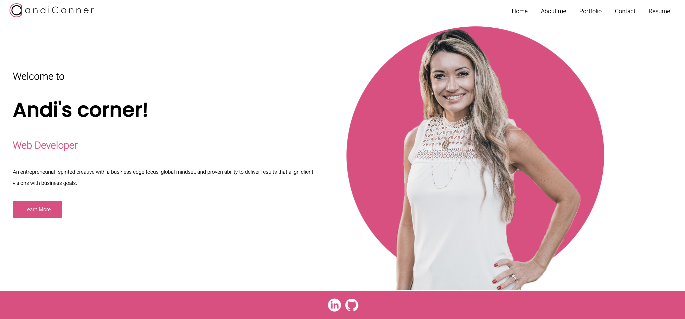
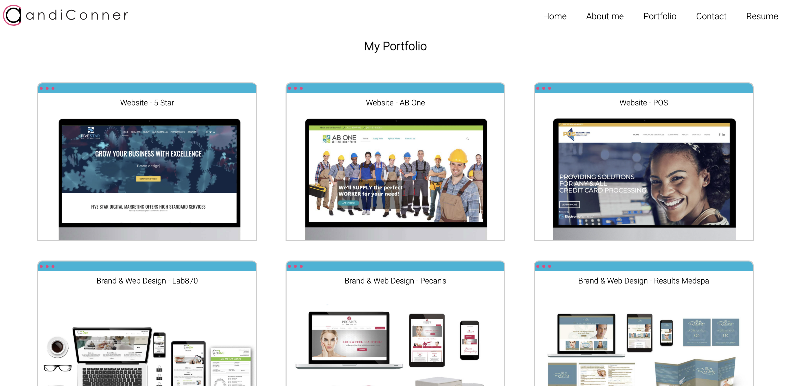
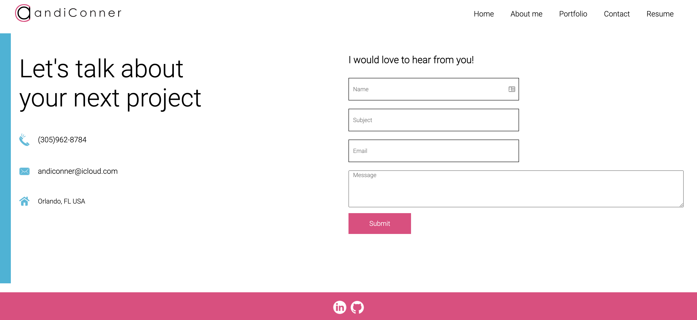

# My Portfolio
 This challenge was to create my portfolio using my new React skills.

## Description 
This app will be a place to showcase and share my projects with employers and with fellow developers and collaborate on future projects.

## Table of Contents

* [Screenshots](#screenshots)
* [Questions](#questions) 

## Screenshots

Here are some images showing the app pages:

Homepage

About Me page

Portfolio

Contact

## Questions
If you have any questions about the repo, please send an [email](mailto:andiconner@icloud.com). You can find more of my work at  [my gitub profile page](https://github.com/andiconner)
